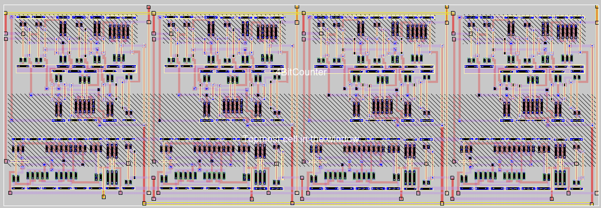

# 4 bits counter

This project was part of the VLSI Design course at the EAMTA 2024. 

Everything was done using open-source EDA tools, with a Docker container which can be found at https://github.com/iic-jku/IIC-OSIC-TOOLS. We used _xschem_ for the schematics, _magic_ for the layout and _netgen_ for the LVS.

The repo only contains a folder called `designs` which should be placed under the `eda` folder that is created using the given tools. This way you can access the project from `foss/designs` within the Docker container. Inside this folder we've placed all the schematic related files under `sch` and all the layout related files under `mag`.

